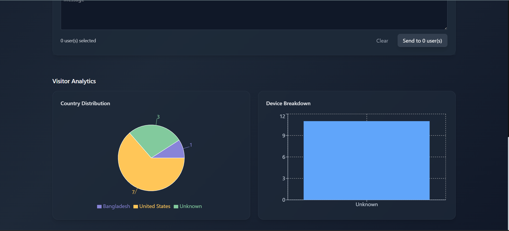
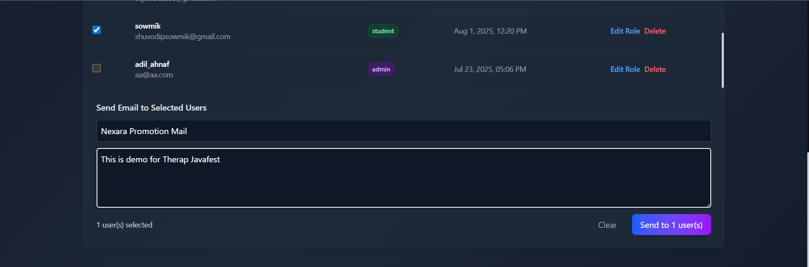
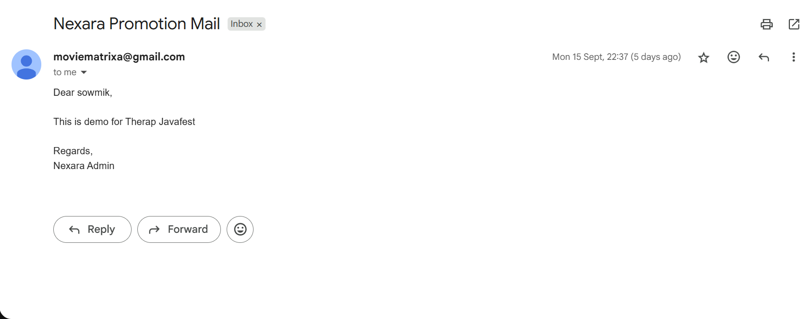

## Developers:

Md. Kaisarul Islam Estey

Shuvodip Das

Undergraduate Students, Dept. of CSE, BUET

## Tech Stack:
- **Backend:** Spring Boot
- **Frontend:** React
- **API Services:** OpenAI GPT 4o Mini (LLM), Qdrant (Vector Database), Cohere (Embedding Generation)
- **Database:** PostgreSQL
- **Auth:** JWT HTTPOnly Cookies
- **Deployment:** Render & Docker [Backend], Vercel [Frontend]

## About:
Nexara is a study helper AI powered web app for students that is built with a **RAG Pipeline** for better context awareness. One of the most exceptional features of the web app is our personalized **Post Ranking Algorithm** that ranks the posts on a user's feed based on the User Activity, Recency, and Post Engagement.

## Live Website:
https://nexara-ydil.vercel.app/

**The Server spins down after 15 minute of inactivity, and might take upto 50s to start again. The experience should be seamless onwards**

## Documentation:

https://docs.google.com/document/d/1-gH--bNKIUSYi9uuPrSnPfLPGE4VSLjKgMmKjk739ew/edit?usp=sharing

**Find detailed algorithm, workflows, Database ERD, challanges and our proposed solution from the documentation presented with visual diagrams**

## Core Features:
- Context Awareness [Implemented with Embedding Generation API, and Vector Database]
- Personalized Post Ranking [Implemented with our self designed Post Ranking Algorithm (Detailed Workflow in the documentation)]

## Features Overview:
- Student & Admin roles
- Community with posts upload, upvote/downvote, nested comment feature
- Personalized Post Ranking in community feed
- Chatbot with and without Context Aware feature
- Track of past chat history
- Context update by uploading PDF
- Taking Subjective & MCQ Exams directly from Chat History / Uploaded PDF
- Youtube video summarization
- Personalized dashboard to track progress
- Admin Dashboard with user management, visitor analytics & bulk newsletter sending

## Youtube Video Summarization

A public feature any user can access without even logging in. Simply copy pasting a youtube url will summarize the video content in a moment.

## SignUp

Role-based access ensures students can focus on learning, while admins manage the platform’s operations and content.

## Post, React, Comment

Even though the system is AI powered, our community interaction feature provides the human touch in the overall experience of the users.

A CSE student will not want to see Cell division / Immune System related posts on his/her community feed at the beginning, he/she would rather prefer posts that discuss Recursion or SQL

Our system smartly handles this problem providing the users with their preferred posts first, and so A Medical Student will have Medical/Biology related post on his/her feed first

Engage in relevant conversation in the same post with nested commenting feature. Nested commenting in posts can expand as far as you can imagine.

## Chat without Context Aware Feature

Context aware answers are costly [by means of API Calls, as we need to call 3 APIs (Embedding Generation, Vector Database, and Open AI Chat Completion)]. If a user wants a generic answer without requiring personalized touch, they can turn off the context awareness feature.

## Upload PDF to Add Context

Uploading PDF adds context in our application. It helps the system to provide personalized experience for each user. Students usually need the chatbot to stay on topic and provide responses relevant to what they are studying in class. This feature allows the student to directly upload their study materials, and get relevant responses.

## Chat with Context Aware Feature

If the user rather prefers chatbot to stay on relevant topic to user's study materials, the application can collect context from previous interactions and provide personalized and better responses.

## Access Previous Chat History

Our system stores previous chats in the database, providing it with a meaningful topic name, allowing users to track all the past chats with the chatbot.

## Summarize your Chat History

Often chat histories get too lengthy. When students are finally done chatting on a topic, they might be required to scroll 100 miles up to get an overview of what they learned. This feature allows the user to summarize the chat history by the choice of their length [1 min read, 2 min read, 5 min read], generate PDF of the summary, and even take an exam on what they studied.

## Take MCQ or Subjective Exam

Besides being able to take exams from the chat history summary, users can also take exams directly from the uploaded pdf, after choosing Number of Questions, and Exam type [MCQ, Subjective].

Get Summmary of your Performace

## Track Your Performance from Dashboard

Users get a customized dashboard that tracks their learning journey, interaction with the community, and uploaded PDFs.

## Manage Users of this Platform and Get Analytics of Visitors, Send Newsletter to All Users on One Click from Admin Dashboard

Admins can manage users, monitor visitor activity with analytics, and easily send newsletters to all users at one click.

## Post Ranking Algorithm

- When the user logs in, system calculates the average user vector embedding, and fetches all posts and calculates their embedding too

- A similarity score is assigned for each post calculating the Cosine Similarity [Dot Product of two embedding/ product of magnitude of two embedding] of the user embedding and post embedding. Then, engagement score and recency score are also assigned for each post.

- Overall score is the weighted sum of all 3 scores.

- Whichever post has a higher score, is ranked higher than that of the lower ones.

- Since each user has different User Embedding [for different activities], they have different rankings of the same set of posts in the community feed.

## Context Awareness Workflow

- Upon user activities such as, Chatting with the chat bot, Posting in the platform, uploading pdf, the relevant texts are chunked per page.

- For each chunk, the system generates an embedding using Cohere’s Embedding Generation API.

- In the Qdrant vector database, the vector embedding is inserted with the text chunk, username, context type [post / chat / pdf] in the payload.

- Next time, when the user provides the chatbot with a prompt, with a message, an embedding is generated again in the same way.

- Our system then queries the Qdrant vector database, “For this user what are the 3 most similar text chunks currently existing in the Qdrant database” [ It basically fetches 3 most similar texts with payload.user = [username] ]

- Upon fetching the similar text chunks, they are binded with the user prompt and sent to OpenAI API.

- The API now provides response based on the context of particular user

## Possible Optimization in Post Ranking Workflow

**Further Optimization was possible, but we did not want to store the embeddings of huge size in the database as we were on a free trial account.**

- Clearly, there exists an optimization issue in our workflow. We had to calculate the user embedding & post embedding, each time the user refreshed the tab.

- To optimize this we had to store the User Embedding, and Post Embedding in the database. But, we used embeddings of size 1024 x 1024 in our project. Storing each embedding from each chat response, each post, each pdf would take up a whole lot of storage of our cloud hosted database with a 500 MB storage limit.

# How we addressed it from the frontend:

- Since we used React in frontend, and React uses virtual DOM, which does not require refresh every time upon navigating to a new page, we saved the posts data in a React Context, that allows the frontend application to fetch the ranked posts [calculate embeddings] only once during a session.

- Although it does not optimize the time, it definitely optimizes the API service cost by 90%. 

- Storing embeddings in the database, however, would make the amortized cost of API services to almost zero.
