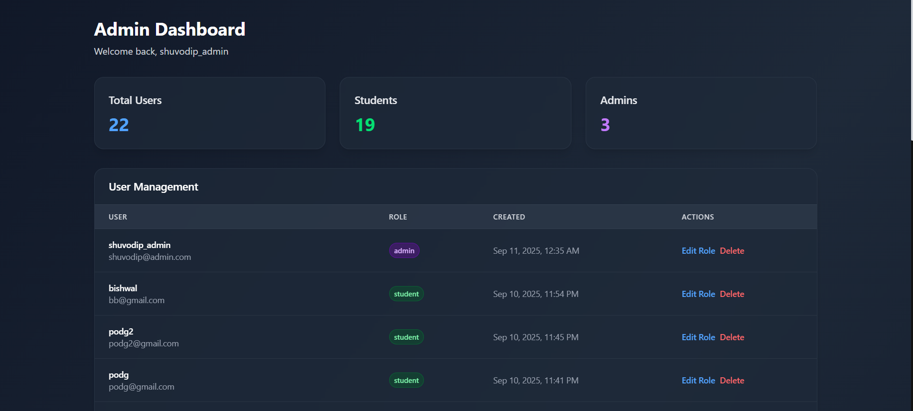

## Developers:

Md. Kaisarul Islam Estey
Shuvodip Das

## Tech Stack:
- **Backend:** Spring Boot
- **Frontend:** React
- **API Services:** OpenAI GPT 4o Mini (LLM), Qdrant (Vector Database), Cohere (Embedding Generation)
- **Database:** PostgreSQL
- **Auth:** JWT HTTPOnly Cookies
- **Deployment:** Render & Docker [Backend], Vercel [Frontend]

## About:
Nexara is a study helper AI powered web app for students that is built with a **RAG Pipeline** for better context awareness. One of the most exceptional features of the web app is our personalized **Post Ranking Algorithm** that ranks the posts on a user's feed based on the User Activity, Recency, and Post Engagement.

## Live Website:
https://nexara-ydil.vercel.app/

**The Server spins down after 15 minute of inactivity, and might take upto 50s to start again. The experience should be seamless onwards**

## Core Features:
- Student & Admin roles
- Community with posts upload, upvote/downvote, nested comment feature
- Personalized Post Ranking in community feed
- Context aware chatbot
- Track of past chat history
- Context update by uploading PDF
- Taking Subjective & MCQ Exams directly from Chat History / Uploaded PDF
- Youtube video summarization
- Personalized dashboard to track progress
- Admin Dashboard with user management, visitor analytics & bulk newsletter sending

## Youtube Video Summarization [Public Feature]

## SignUp

Sign Up as a Student or an Admin

## Post, React, Comment

A CSE Student has CS Related Post on his/her feed first

However, A Medical Student will have Medical/Biology related post on his/her feed first

Engage in relevant conversation in the same post with nested commenting feature

## Chat without Context Aware Feature

## Upload PDF to Add Context

## Chat with Context Aware Feature

## Access Previous Chat History

## Summarize your Chat History

## Take MCQ or Subjective Exam

Get Summmary of your Performace

## Track Your Performance from Dashboard

## Manage users of this platform and get Analytics of Visitors from Admin Dashboard

## Post Ranking Algorithm

Nexara ranks community posts for each user using a compact weighted scoring model that balances three signals:

- Engagement: combines likes and comments into a single engagement value.
- Recency: applies an exponential time-decay function, so newer posts are preferred.
- Similarity: computes cosine similarity between post and user embedding vectors to measure topical relevance.

The final score is a weighted sum of these components:

score = (engagement * engagementCoefficient) + (recency * recencyCoefficient) + (similarity * similarityCoefficient)

Coefficients are tuned to prioritize relevant, fresh, and engaging content so each user's feed is personalized.